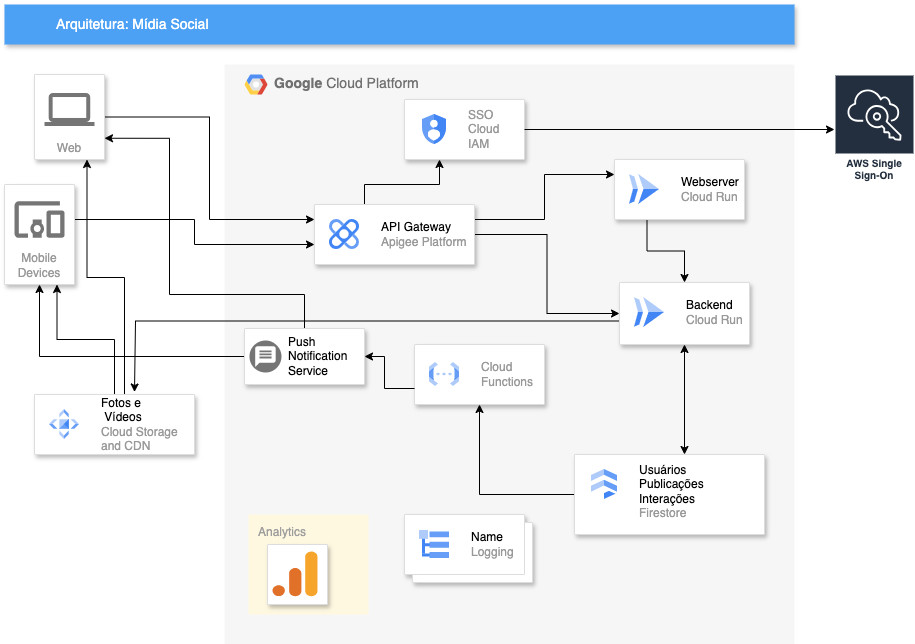
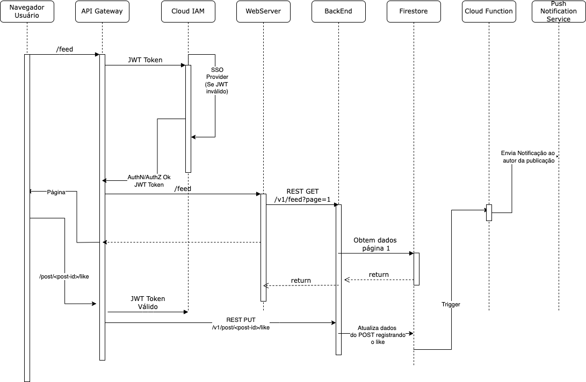

# Projeto Mídia Social

Esta é a arquitetura geral de um projeto de mídia social onde os usuários podem criar publicações de texto, fotos ou vídeo e registrar reações e comentários.

O provedor cloud escolhido foi o Google Cloud Platform, podendo o projeto ser facilmente adaptado a outros provedores cloud como AWS, Azure ou IBM.

## Diagrama de alto nível da arquitetura do projeto

## Modelo de dados
[Modelo de dados](ModeloDados.md)

## Diagrama de comunicação entre os serviços

